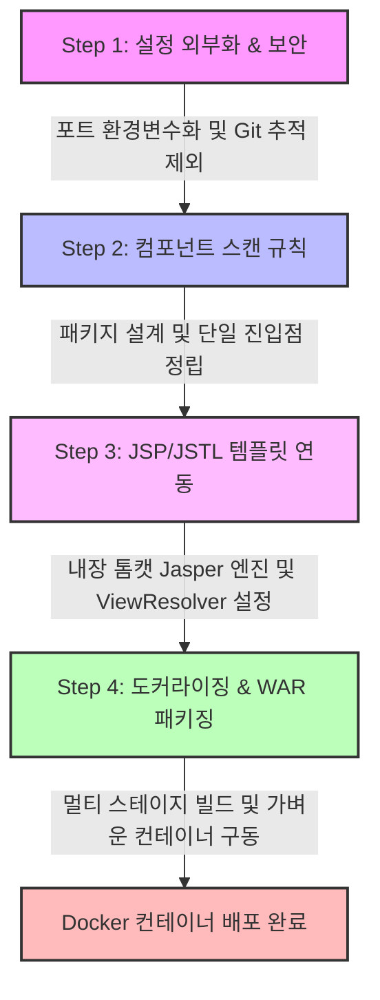

# 🚀 Boot Legacy 실습 프로젝트

스프링 부트(Spring Boot 3.x) 환경에서 레거시 기술 스펙(JSP, JSTL)을 수용하고, 설정 외부화 및 컨테이너 기반 배포(Docker Multi-stage Build)까지 점진적으로 고도화하는 학습용 저장소입니다.

---

## 🛠️ 기술 스택 (Tech Stack)

---

## 🗺️ 프로젝트 점진적 고도화 로드맵 (Roadmap)

---

## 📂 단계별 학습 문서 (Step-by-Step Guides)

각 브랜치와 실습 단계에 대한 세부 아키텍처 및 원리 분석은 아래의 개별 문서에서 확인할 수 있습니다.

### 🔌 [Step 1: 설정 외부화 및 Git 보안 설정](file:///Users/morgan/Documents/workspace/boot-legacy/step1.md)
* **핵심 주제**: `server.port=${PORT:8080}` 동적 환경 변수 주입 및 `.gitignore`를 통한 환경 변수 설정 파일(`.env`) 보안 관리.
* **관련 기술**:
  
  

### 🕵️‍♂️ [Step 2: 컴포넌트 스캔 및 패키지 레이아웃](file:///Users/morgan/Documents/workspace/boot-legacy/step2.md)
* **핵심 주제**: `@SpringBootApplication` 어노테이션의 패키지 루트 위치 중요성 및 스프링 빈(Bean) 스캔 탐색 범위 오류 분석.
* **관련 기술**:
  
  

### 🧪 [Step 3: 레거시 JSP/JSTL 연동](file:///Users/morgan/Documents/workspace/boot-legacy/step3.md)
* **핵심 주제**: 내장 톰캣(`tomcat-embed-jasper`) 환경에서 JSP 파일 분석 메커니즘 구축 및 Jakarta EE 10 스펙 하의 JSTL API/구현체 이중 의존성 설정.
* **관련 기술**:
  
  
  

### 🍱 [Step 4: Docker 멀티 스테이지 빌드 및 WAR 패키징](file:///Users/morgan/Documents/workspace/boot-legacy/step4.md)
* **핵심 주제**: JSP 리소스의 가상 디렉토리 규격 유지를 위한 `WAR` 패키징(`Executable WAR`) 채택, 빌드/런타임 레이어를 분리하는 Docker 멀티 스테이지 빌드 도입 및 중복 진입점(`@SpringBootApplication`) 제거.
* **관련 기술**:
  
  
  
