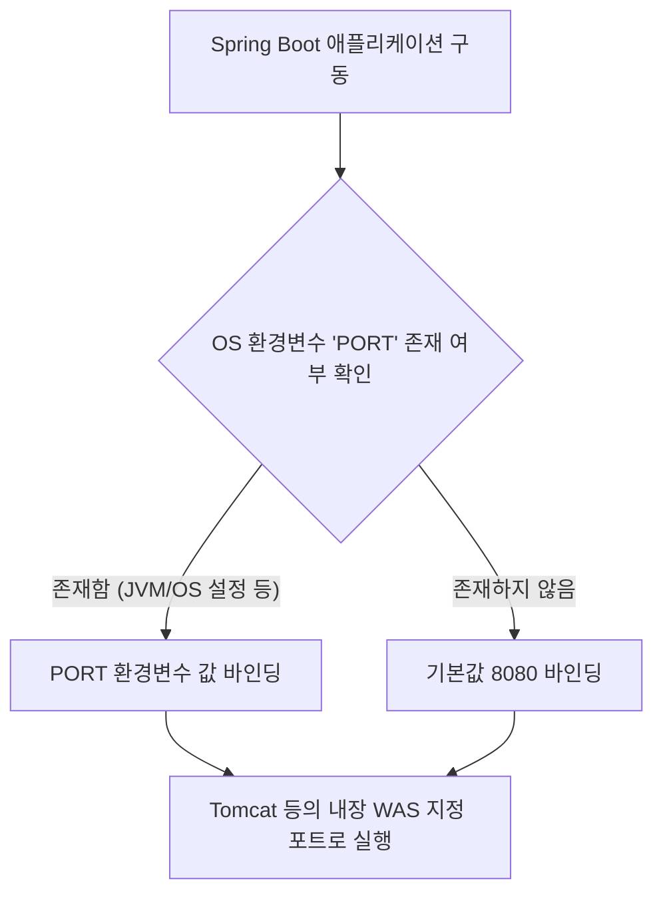

# 🚀 Step 1 브랜치 상세 분석 보고서
> **Spring Boot 기반 설정 외부화 및 Git 보안 설정 이해**

스프링 부트 환경에서의 `step1` 브랜치 변경 사항에 대해 비유, 작동 원리, 그리고 기술 면접 대비 관점에서 깊이 있게 분석한 문서입니다.

---

## 🛠️ 변경 사항 요약

본 브랜치에서는 아래 두 파일에 대한 변경 사항이 적용되어 있습니다.

| 변경 대상 파일 | 주요 변경 내용 | 목적 |
| :--- | :--- | :--- |
| [`src/main/resources/application.properties`](file:///Users/morgan/Documents/workspace/boot-legacy/src/main/resources/application.properties) | `server.port=${PORT:8080}` 추가 | 서버 포트 번호의 동적 환경변수화 및 기본값(8080) 설정 |
| [`.gitignore`](file:///Users/morgan/Documents/workspace/boot-legacy/.gitignore) | `.env` 제외 항목 추가 | 환경변수/보안 설정 파일의 Git 추적 제외 |

---

## 💡 1. 초심자를 위한 비유 (Beginner's Analogy)

### 🔌 1) `server.port=${PORT:8080}` : 스마트 멀티탭
이 설정은 배달원이 소포를 배달할 때 **"기본적으로는 8080호로 배달해주세요. 하지만 경비실에서 다른 호수(PORT)를 지정해 주면 그 호수로 가주세요."** 라고 안내문을 써 붙인 것과 같습니다.

* **`${PORT}`**: 배달원에게 동적으로 지시하는 경비실 안내문 (환경 변수)
* **`:8080`**: 별도의 안내가 없을 때 배달원이 찾아가는 기본 호수 (기본값)
* **스프링 부트**: 안내문을 읽고 서버의 위치를 알아서 찾아가는 똑똑한 배달원

---

### 🔐 2) `.env`와 `.gitignore` : 비밀 금고와 외부 노출 차단막
로컬 환경의 비밀번호나 포트 설정이 적힌 `.env` 파일은 집 안의 **"개인 금고"**입니다. 이 금고의 위치와 비밀번호가 담긴 정보는 다른 사람들에게 공개되는 동네 게시판(GitHub)에 올라가면 안 됩니다. 
* **`.env`**: 우리 팀의 기밀이 담긴 개인 금고
* **`.gitignore`**: 동네 사진을 찍어 올릴 때, 금고가 있는 방은 사진에 찍히지 않도록 가려주는 **"안막 커튼"**

---

## ⚙️ 2. 주니어를 위한 작동 원리 (Junior's Deep Dive)

### 🔄 1) Spring Boot의 프로퍼티 해석 구조
Spring Boot는 애플리케이션 기동 시 `Environment` 추상화 모델을 생성하고, 다양한 프로퍼티 소스(Property Sources)로부터 설정을 로드합니다.

### 🧬 2) `${PORT:8080}`의 동작 메커니즘
스프링 부트 내부에서는 `PropertySourcesPlaceholderConfigurer` 클래스가 구동되며, `${...}` 형식의 플레이스홀더를 파싱합니다.
1. `PORT`라는 키(Key)로 등록된 프로퍼티 소스가 있는지 검색합니다.
   * `System.getenv("PORT")` (OS 환경변수)
   * `System.getProperty("PORT")` (JVM 시스템 프로퍼티)
2. 만약 해당 키가 비어있거나 찾을 수 없다면, 콜론(`:`) 구분자 뒤에 지정된 리터럴 값 `8080`을 최종 값으로 결정합니다.

### 🏗️ 3) 12-Factor App 방법론과의 연관성
현대 클라우드 네이티브 애플리케이션 설계 방법론인 **The Twelve-Factor App**의 세 번째 항목은 **"Config(설정: 환경에 설정 저장)"**입니다.

> 💡 **핵심 요약**: 설정(포트 번호, 데이터베이스 접속 정보 등)은 코드 변경 없이 배포 환경(Dev, Staging, Production)에 따라 다르게 주입될 수 있도록 **코드와 철저히 분리**되어야 합니다. `.env` 파일을 로컬에 두고 Git에 커밋하지 않는 방식은 이러한 원칙을 따르기 위함입니다.

---

## 🙋 3. 면접 대비 예상 질문 & 모범 답안 (Interview Prep)

### Q1. Spring Boot에서 `${PORT:8080}` 형태의 설정 방식이 가지는 장점은 무엇이며 내부적으로 어떻게 동작하나요?
* **답안**:
  * **장점**: 배포 환경에 따라 별도의 빌드 과정 없이 동적으로 포트를 할당할 수 있습니다. 예를 들어 클라우드 플랫폼(Heroku, AWS Elastic Beanstalk 등)은 실행 시 임의의 `PORT` 환경 변수를 할당하는데, 이러한 동적 환경에 유연하게 대응할 수 있습니다.
  * **동작 원리**: 스프링의 `PropertySourcesPlaceholderConfigurer`가 `${value:default}` 구문을 파싱하여 `Environment` 객체에 등록된 프로퍼티 소스들 중 `value`에 해당하는 값을 조회하고, 존재하지 않을 경우 `:` 뒤의 `default` 값을 할당합니다.

---

### Q2. Spring Boot의 외부 설정(Externalized Configuration) 우선순위에 대해 설명하고, `application.properties`와 OS 환경 변수 중 무엇이 우선시되는지 답해주세요.
* **답안**:
  * Spring Boot는 외부 설정을 로드할 때 정교한 우선순위 규칙을 따릅니다. 총 17가지 이상의 단계가 있으나, 핵심적인 우선순위는 다음과 같습니다 (높은 순서대로):
    1. Command Line Arguments (명령행 인자, 예: `--server.port=9000`)
    2. JVM System Properties (Java 시스템 프로퍼티, `-Dserver.port=9000`)
    3. **OS Environment Variables (OS 환경변수, `PORT=9000`)**
    4. **Application Properties (클래스패스 내부의 `application.properties`)**
  * 따라서 OS 환경변수가 `application.properties` 내의 설정값보다 우선순위가 높기 때문에 환경 변수로 지정된 포트 번호가 실제로 적용됩니다.

---

### Q3. `.env` 파일의 목적은 무엇이며, 왜 `.gitignore`에 등록하여 관리해야 하나요?
* **답안**:
  * **목적**: `.env` 파일은 로컬 개발 환경에서 환경변수들을 통합 관리하고 애플리케이션 구동 시 주입해주기 위해 사용하는 텍스트 파일입니다.
  * **보안성**: 일반적으로 `.env` 파일에는 DB 비밀번호, API Secret Key 등 민감한 자격 증명 정보가 포함될 확률이 높습니다. 이를 Public Git Repository에 커밋하게 되면 자격 증명 유출 사고로 이어질 수 있으므로, 반드시 `.gitignore`에 추가하여 로컬 환경에만 유지되도록 통제해야 합니다.
  * **환경 분리**: 로컬 개발자의 시스템 사양이나 로컬 DB 접속 정보가 다른 팀원이나 서버 환경의 설정과 간섭을 일으키지 않도록 격리하기 위함이기도 합니다.
