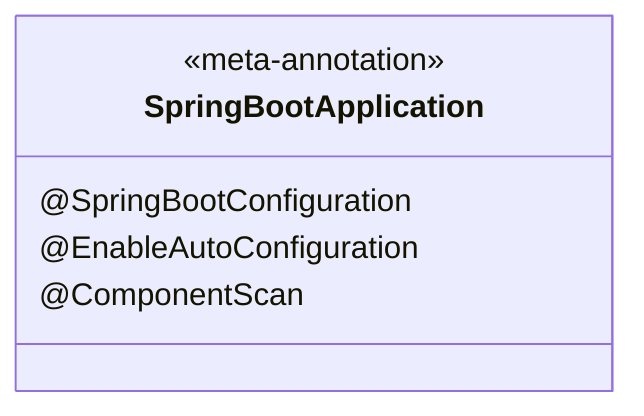

# 🚀 Step 2 브랜치 상세 분석 보고서
> **스프링 부트의 컴포넌트 스캔(Component Scan)과 패키지 구조의 중요성**

스프링 부트 환경에서의 `step2` 브랜치 변경 사항에 대해 비유, 작동 원리, 그리고 기술 면접 대비 관점에서 컴포넌트 스캔(Component Scan) 메커니즘을 상세히 분석한 문서입니다.

---

## 🛠️ 변경 사항 요약

본 브랜치에서는 컴포넌트 스캔의 탐색 범위를 실습하기 위해 아래와 같이 패키지를 나누고 컨트롤러와 실행 클래스를 작성했습니다.

| 클래스 파일 | 패키지 경로 | 주요 어노테이션 | 특징/비고 |
| :--- | :--- | :--- | :--- |
| [`BootLegacyApplication`](file:///Users/morgan/Documents/workspace/boot-legacy/src/main/java/org/example/bootlegacy/BootLegacyApplication.java) | `org.example.bootlegacy` | `@SpringBootApplication` | **최상단 루트 패키지**에 위치. 하위 모든 컴포넌트 스캔 가능 🟢 |
| [`ScanController`](file:///Users/morgan/Documents/workspace/boot-legacy/src/main/java/org/example/bootlegacy/step2/ScanController.java) | `org.example.bootlegacy.step2` | `@RestController` | HTTP 요청을 처리하는 웹 컨트롤러 빈(Bean) |
| [`EntryApplication`](file:///Users/morgan/Documents/workspace/boot-legacy/src/main/java/org/example/bootlegacy/step2/app/EntryApplication.java) | `org.example.bootlegacy.step2.app` | `@SpringBootApplication` | `step2.app` 서브 패키지에 위치. `ScanController` 스캔 불가 🔴 |

---

## 💡 1. 초심자를 위한 비유 (Beginner's Analogy)

### 🕵️‍♂️ 컴포넌트 스캔 : "선생님의 출석체크 범위"
스프링 부트의 `@SpringBootApplication`은 교실 안의 학생들을 찾아서 출석부에 등록하는 **"담임 선생님"**과 같고, `@RestController` 등 스프링 빈 어노테이션이 붙은 클래스는 **"학생"**들과 같습니다.

```mermaid
graph TD
    subgraph [담임 선생님 EntryApplication의 시야]
        TeacherA[선생님: EntryApplication <br> 위치: step2.app 교실] -->|출석체크| StudentA[학생: EntryApplication 자체]
        TeacherA -.->|교실 밖이라 안 보임 ❌| StudentB[학생: ScanController <br> 위치: step2 교실]
    end
```

* **교실 안 (`step2.app`)**: 선생님이 교실 내부만 둘러보기 때문에 교실 안에 있는 요소들만 출석 체크가 가능합니다.
* **복도 건너편 교실 (`step2`)**: 선생님이 위치한 교실의 **상위 또는 옆 반**이기 때문에, 선생님은 복도 건너편 교실에 있는 `ScanController` 학생을 보지 못해 결석 처리(스프링 빈 미등록)하게 됩니다.
* **학교 정문 (`org.example.bootlegacy`)**: 교장 선생님(`BootLegacyApplication`)은 학교 정문(최상단 패키지)에서 지켜보고 있기 때문에 학교 안 모든 반(`step2`, `step2.app` 등)의 학생들을 전부 출석 체크할 수 있습니다.

---

## ⚙️ 2. 주니어를 위한 작동 원리 (Junior's Deep Dive)

### 🧬 1) `@SpringBootApplication` 메타 어노테이션의 비밀
`@SpringBootApplication`은 아래 3가지 핵심 어노테이션의 조합으로 구성된 메타 어노테이션입니다.



1. **`@SpringBootConfiguration`**: 스프링 부트 설정을 제공하는 클래스임을 선언 (`@Configuration`과 동일한 기능).
2. **`@EnableAutoConfiguration`**: 사전에 정의된 외부 라이브러리 설정 정보들을 바탕으로 필요한 빈(Bean)들을 자동으로 등록.
3. **`@ComponentScan`**: 지정된 패키지 경로를 스캔하여 `@Component` 계열 어노테이션(`@Controller`, `@Service`, `@Repository`, `@Configuration` 등)이 붙은 클래스들을 스프링 IoC 컨테이너에 빈으로 등록.

---

### 🔍 2) 컴포넌트 스캔의 디폴트 검색 범위
`@ComponentScan` 어노테이션에 별도의 설정을 하지 않으면, **해당 어노테이션이 선언된 클래스가 속한 패키지와 그 하위 패키지**만 탐색 범위로 지정됩니다.

```
📁 org.example.bootlegacy (BootLegacyApplication 위치 - 하위 모두 스캔 가능 🟢)
 ┗ 📁 step2 (ScanController 위치)
    ┗ 📁 app (EntryApplication 위치 - 상위/형제 패키지인 step2 스캔 불가능 🔴)
```

따라서 `EntryApplication`을 실행하면 다음과 같은 현상이 발생합니다.
* `EntryApplication`이 속한 `org.example.bootlegacy.step2.app` 및 그 하위 패키지만 스캔합니다.
* 형제(상위) 패키지인 `org.example.bootlegacy.step2`에 위치한 `ScanController`는 스캔 대상에서 제외됩니다.
* 결과적으로 `ScanController`가 빈으로 등록되지 않아 웹 브라우저에서 `/` 경로로 접속 시 **404 Not Found** 에러가 발생합니다.

---

### 🛠️ 3) 스캔 범위 문제 해결 방법 (외부 패키지 빈 등록)
만약 디폴트 패키지 외부의 컴포넌트를 스캔하고 싶다면 아래와 같이 명시적으로 범위를 설정해야 합니다.

1. **`scanBasePackages` 속성 사용**:
   ```java
   @SpringBootApplication(scanBasePackages = "org.example.bootlegacy.step2")
   public class EntryApplication { ... }
   ```
2. **`scanBasePackageClasses` 속성 사용**: 스캔을 시작할 기준 클래스를 직접 지정 (Type-safe 방식)
   ```java
   @SpringBootApplication(scanBasePackageClasses = ScanController.class)
   public class EntryApplication { ... }
   ```
3. **패키지 재배치 (가장 권장됨)**:
   Spring Boot 공식 문서 가이드라인에 따라 실행 파일(`@SpringBootApplication` 적용 클래스)을 항상 **최상단 루트 패키지**(`org.example.bootlegacy`)에 두어 하위의 모든 컴포넌트가 자동으로 스캔되도록 아키텍처를 설계합니다.

---

## 🙋 3. 면접 대비 예상 질문 & 모범 답안 (Interview Prep)

### Q1. 스프링 부트에서 컴포넌트 스캔(Component Scan)의 기본 동작 범위와 최상단 패키지에 메인 애플리케이션 클래스를 두는 이유를 설명해주세요.
* **답안**:
  * **기본 범위**: `@SpringBootApplication` 내부에 포함된 `@ComponentScan`은 선언된 클래스가 속한 패키지와 그 하위 패키지만 탐색합니다.
  * **이유**: 메인 애플리케이션 클래스를 루트 패키지에 두면 명시적인 패키지 경로를 추가 설정하지 않아도 프로젝트 내의 모든 컴포넌트(`@Service`, `@RestController` 등)들을 자동으로 인식하여 스프링 컨테이너의 빈으로 등록할 수 있어, 설정 오류를 방지하고 일관된 패키지 탐색 규칙을 가져갈 수 있기 때문입니다.

---

### Q2. `@SpringBootApplication` 메타 어노테이션에 속하는 3가지 핵심 어노테이션과 각각의 역할을 설명해주세요.
* **답안**:
  * **`@SpringBootConfiguration`**: 스프링 부트 설정을 담은 구성 클래스임을 정의합니다.
  * **`@EnableAutoConfiguration`**: 스프링 부트의 강점인 자동 설정을 활성화하여 클래스패스 상에 존재하는 라이브러리(ex: `spring-boot-starter-web`이 있으면 Tomcat 등)를 감지하고 빈을 자동으로 생성합니다.
  * **`@ComponentScan`**: 지정된 패키지 경로 하위의 `@Component` 어노테이션이 달린 컴포넌트(Controller, Service, Repository 등)들을 탐색하여 스프링 컨테이너에 빈으로 등록해 줍니다.

---

### Q3. 패키지 경로가 분리되어 컴포넌트 스캔 범위를 벗어난 다른 클래스(예: 형제 패키지의 컨트롤러)를 스프링 컨테이너에 빈으로 등록하는 방법들을 말해주세요.
* **답안**:
  * 첫째, `@SpringBootApplication`의 속성 중 `scanBasePackages` 혹은 `scanBasePackageClasses`를 사용하여 스캔할 패키지명이나 클래스 기준점을 직접 입력하여 탐색 범위를 넓힙니다.
  * 둘째, 해당 클래스가 속한 패키지에 `@Configuration` 클래스를 만들거나, 메인 구성 클래스 내에 `@Bean` 어노테이션을 사용하여 수동으로 객체를 스프링 빈으로 등록할 수 있습니다.
  * 셋째(가장 권장하는 방식), 메인 애플리케이션 클래스를 모든 컴포넌트들을 아우를 수 있는 공통 최상위 패키지로 이동하여 컴포넌트 스캔 기본 규칙을 따르게 합니다.
