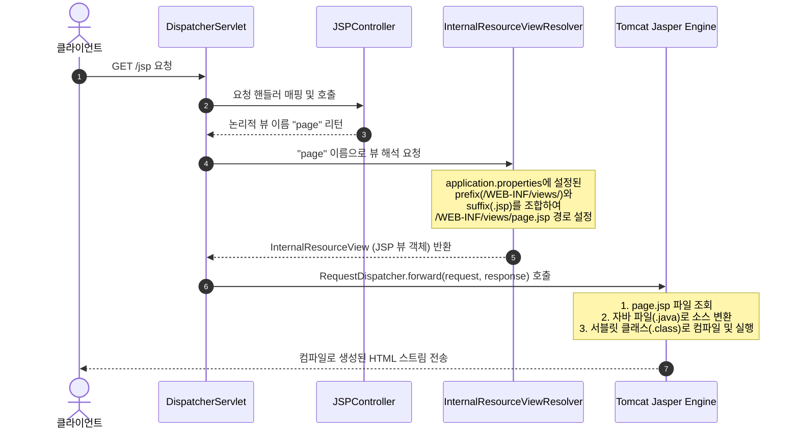

# 🚀 Step 3 브랜치 상세 분석 보고서
> **Spring Boot 환경에서의 레거시 JSP/JSTL 설정 및 동작 원리**

스프링 부트 환경에서의 `step3` 브랜치 변경 사항에 대해 비유, 작동 원리, 그리고 기술 면접 대비 관점에서 JSP 및 JSTL 환경 설정 메커니즘을 상세히 분석한 문서입니다.

---

## 🛠️ 변경 사항 요약

본 브랜치에서는 스프링 부트 프로젝트 내에서 레거시 템플릿 엔진인 JSP와 표준 태그 라이브러리(JSTL)를 연동하기 위해 다음과 같은 의존성 및 프로퍼티를 추가하고 테스트용 컨트롤러와 뷰를 작성했습니다.

| 변경 대상 파일 | 주요 변경 내용 | 목적 |
| :--- | :--- | :--- |
| [`pom.xml`](file:///Users/morgan/Documents/workspace/boot-legacy/pom.xml) | `tomcat-embed-jasper`, `jakarta.servlet.jsp.jstl-api`, `jakarta.servlet.jsp.jstl` 의존성 추가 | 내장 톰캣 환경에서 JSP 파일을 해석/컴파일(Jasper)하고 JSTL 태그 라이브러리를 정상 작동시키기 위함 |
| [`src/main/resources/application.properties`](file:///Users/morgan/Documents/workspace/boot-legacy/src/main/resources/application.properties) | `spring.mvc.view.prefix`, `spring.mvc.view.suffix` 설정 추가 | 컨트롤러가 리턴한 논리 뷰 이름을 실제 JSP 파일이 위치한 물리적 경로로 포워딩하기 위한 View Resolver 설정 |
| [`JSPController.java`](file:///Users/morgan/Documents/workspace/boot-legacy/src/main/java/org/example/bootlegacy/step3/JSPController.java) | `@Controller` 클래스 및 GET `/jsp` 매핑 정의 | HTTP 요청을 받아 물리 뷰 템플릿과 매핑될 논리 뷰 이름 `"page"`를 반환 |
| [`page.jsp`](file:///Users/morgan/Documents/workspace/boot-legacy/src/main/webapp/WEB-INF/views/page.jsp) | `/WEB-INF/views/` 하위에 기본 JSP 파일 추가 | 최종 클라이언트에게 전달되어 웹 브라우저 상에 렌더링될 JSP 화면 |

---

## 💡 1. 초심자를 위한 비유 (Beginner's Analogy)

### 🔌 1) `tomcat-embed-jasper` : 외부 언어 번역 앱
스프링 부트는 기본적으로 Thymeleaf나 HTML 같은 현대적인 언어만 잘 읽는 최신 스마트폰입니다. 반면 JSP는 옛날 웹 생태계에서 널리 쓰이던 고전 언어에 가깝습니다. 스마트폰은 기본적으로 이 옛날 언어를 해석할 능력이 내장되어 있지 않습니다.
* **`tomcat-embed-jasper`**: 스마트폰에 설치하는 **"고전 언어 번역 앱"**입니다. 이 앱을 설치해야만 스마트폰(내장 톰캣)이 JSP 파일을 읽고 우리말로 최종 화면(HTML)을 그릴 수 있게 됩니다.

---

### 🗺️ 2) View Resolver 설정 (Prefix / Suffix) : 주소 단축 규칙
매번 우편물을 보낼 때마다 "서울특별시 강남구 테헤란로 123번지 OO빌딩 4층 401호"라고 전체 주소를 다 적는 일은 매우 불편합니다. 그래서 우체부와 규칙을 정합니다.
* **접두사 (Prefix)**: "앞부분에는 무조건 '서울특별시 강남구 테헤란로 123번지 OO빌딩 4층/'을 생략해서 적겠습니다." (`/WEB-INF/views/`)
* **접미사 (Suffix)**: "뒷부분에는 무조건 '.jsp'를 생략해서 적겠습니다." (`.jsp`)
이제 컨트롤러(발송인)는 단축 번호인 **"page"**만 적어주면, 우체부(View Resolver)가 앞뒤를 자동으로 붙여서 **"/WEB-INF/views/page.jsp"**라는 정확한 물리적 주소를 완성하여 배달(포워딩)해 줍니다.

---

## ⚙️ 2. 주니어를 위한 작동 원리 (Junior's Deep Dive)

### 🧬 1) 스프링 부트와 JSP의 패키징 관계 (JAR vs WAR)
스프링 부트는 단일 파일로 손쉽게 배포할 수 있는 **JAR(Java Archive)** 패키징을 기본으로 권장합니다. 하지만 JSP는 다음과 같은 구조적 제약으로 인해 JAR 배포 환경과 잘 맞지 않습니다.
* **물리적 파일 경로 요구**: JSP는 런타임에 동적으로 자바 클래스로 변환 및 컴파일되어야 하므로 서블릿 컨테이너(Tomcat) 상에 디렉토리 구조(`WEB-INF`) 형태로 실재해야 합니다.
* **클래스패스 탐색 제약**: JAR 파일 내부로 패키징할 경우, `src/main/webapp` 경로가 클래스패스 외부에 남게 되거나 내장 WAS가 JAR 안의 JSP 템플릿 리소스를 정상적으로 찾아내 컴파일하는 데 기술적 한계가 존재합니다.
* **해결책**: 스프링 부트 공식 가이드는 JSP 사용 시 **WAR(Web Application Archive)** 패키징을 사용할 것을 권장하지만, 개발 단계에서는 `tomcat-embed-jasper` 의존성을 추가하여 내장 톰캣의 Jasper 뷰 컴파일 엔진을 포함시킴으로써 JAR 구동 환경에서도 JSP 탐색과 컴파일이 가능하게 지원합니다.

---

### 🔄 2) JSP 뷰 해석(View Resolution) 및 렌더링 동작 흐름
컨트롤러가 단순 문자열 `"page"`를 반환했을 때 웹 브라우저에 최종 화면이 출력되기까지의 내부 흐름은 아래와 같습니다.

---

### 🏗️ 3) Jakarta EE 10 스펙 하에서의 JSTL 의존성 구성
Spring Boot 3.x 버전부터는 Java EE 대신 **Jakarta EE 9/10** 스펙을 사용합니다.
이에 따라 패키지 네임스페이스가 기존 `javax.servlet`에서 `jakarta.servlet`으로 마이그레이션되었기 때문에 JSTL 설정에 유의해야 합니다.
1. **API 정의**: `jakarta.servlet.jsp.jstl-api` (컴파일 시점에 태그 라이브러리 스펙을 참조하기 위함)
2. **실제 구현체**: `org.glassfish.web:jakarta.servlet.jsp.jstl` (런타임에 JSP 서블릿 컴파일러가 JSTL 태그를 만나 실질적으로 변환 및 구동을 담당함)
두 의존성을 모두 올바르게 셋팅해야만 JSP 파일 내에서 `<c:forEach>`, `<c:if>` 등의 핵심 태그를 런타임 오류 없이 사용할 수 있습니다.

---

## 🙋 3. 면접 대비 예상 질문 & 모범 답안 (Interview Prep)

### Q1. Spring Boot에서 JSP 사용을 공식적으로 권장하지 않는 이유와 단점들을 설명해 주세요.
* **답안**:
  * **패키징 호환성**: Spring Boot는 단일 JAR 파일 빌드 및 실행을 핵심 가치로 가집니다. 그러나 JSP는 표준 디렉토리 구조(`WEB-INF` 등)에 의존하여 동작하기 때문에 JAR 형태로 압축 배포되었을 때 리소스 경로 검색 실패 등 오동작이 빈번히 발생합니다.
  * **내장 WAS 종속성**: Tomcat이 아닌 Undertow나 Jetty 등 타 서블릿 컨테이너로 내장 서버를 전환할 때 JSP 컴파일 성능이 떨어지거나 부가 설정이 까다로워 이식성이 제한됩니다.
  * **Natural Templates 미지원**: Thymeleaf 같은 템플릿 엔진은 서버를 띄우지 않고도 브라우저에서 디자인 레이아웃을 그대로 열어볼 수 있는 반면, JSP는 무조건 WAS 환경에 배포되어 컴파일 과정을 거쳐야만 화면을 볼 수 있어 프론트엔드 협업과 피드백 주기가 느려집니다.

---

### Q2. `InternalResourceViewResolver`가 동작하여 컨트롤러 리턴값으로부터 JSP 뷰로 포워딩하는 과정을 라이프사이클 관점에서 설명해주세요.
* **답안**:
  1. 클라이언트 요청이 `DispatcherServlet`으로 들어오면 핸들러 매핑을 통해 대상 컨트롤러가 호출됩니다.
  2. 컨트롤러가 논리적 뷰 명칭(예: `"page"`)을 반환하면 `DispatcherServlet`은 이 정보를 들고 `ViewResolver` 체인을 돌며 적합한 뷰 해석기를 찾습니다.
  3. `InternalResourceViewResolver`가 이를 가로채서 설정된 prefix(`"/WEB-INF/views/"`)와 suffix(`".jsp"`)를 합쳐 물리 경로 `"/WEB-INF/views/page.jsp"`를 담은 `InternalResourceView` 객체를 반환합니다.
  4. `DispatcherServlet`은 `InternalResourceView` 객체의 `render()` 메소드를 호출하며, 내부적으로 `ServletRequest`에서 `RequestDispatcher`를 획득하여 물리 경로로 `forward()`를 수행합니다.
  5. 최종적으로 서블릿 컨테이너 내부에서 JSP가 서블릿으로 컴파일되어 실행되고, 처리 결과인 HTML이 응답 스트림으로 클라이언트에게 반환됩니다.

---

### Q3. Spring Boot 3.x 프로젝트에서 JSP 표준 태그 라이브러리(JSTL)를 설정할 때 반드시 구현체(Implementation) 의존성을 함께 추가해야 하는 이유를 설명해 주세요.
* **답안**:
  * Spring Boot 3.x는 **Jakarta EE** 표준 규격을 따릅니다. JSTL의 경우 명세(Specification)만 정의한 `jakarta.servlet.jsp.jstl-api` 라이브러리만 단독으로 빌드 경로에 존재할 경우, 자바 인터페이스와 규격 정보만 있고 이를 컴파일하고 해석할 실제 비즈니스 로직(클래스)이 런타임 메모리에 존재하지 않습니다.
  * 따라서 JSP 페이지가 구동되는 런타임 환경에서 JSTL 태그 라이브러리를 실제로 실행할 수 있도록 `org.glassfish.web:jakarta.servlet.jsp.jstl`와 같은 구현체 라이브러리를 반드시 의존성에 명시해주어야 런타임 시 태그가 올바르게 HTML로 번역되고 ClassNotFoundException과 같은 런타임 오류가 발생하지 않습니다.
